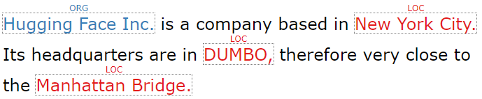

# seqviz

**seqviz** (sequence visualization) is a Python package to visualize sequence tagging results. It can be either be used
to print to console or in Jupyter Notebooks.

## Usage

You can load tagged sentences from many common formats:

**iob1**

```python
from seqviz import TaggedSequence

data = [
    ('Alex', 'I-PER'),
    ('is', 'O'),
    ('going', 'O'),
    ('to', 'O'),
    ('Los', 'I-LOC'),
    ('Angeles', 'I-LOC'),
    ('in', 'O'),
    ('California', 'I-LOC')
]

tagged = TaggedSequence.from_bio(data, fmt="iob1")

print(tagged) # [Alex](PER) is going to [Los Angeles](LOC) in [California](LOC)
```

**iob2**

```python
from seqviz import TaggedSequence

data = [
    ("Today", "O"),
    ("Alice", "B-PER"),
    ("Bob", "B-PER"),
    ("and", "O"),
    ("I", "B-PER"),
    ("ate", "O"),
    ("lasagna", "O"),
]

tagged = TaggedSequence.from_bio(data, fmt="iob2")

print(tagged) # Today [Alice](PER) [Bob](PER) and [I](PER) ate lasagna
```

**BIOES**

```python
from seqviz import TaggedSequence

data = [
    ("Alex", "S-PER"),
    ("is", "O"),
    ("going", "O"),
    ("with", "O"),
    ("Marty", "B-PER"),
    ("A", "I-PER"),
    ("Rick", "E-PER"),
    ("to", "O"),
    ("Los", "B-LOC"),
    ("Angeles", "E-LOC")
]

tagged = TaggedSequence.from_bio(data, fmt="bioes")

print(tagged) # "[Alex](PER) is going with [Marty A Rick](PER) to [Los Angeles](LOC)"
```

## Output formats

Use it in terminal via `str(seq)`:

    [Alex](PER) is going to [Los Angeles](LOC) in [California](LOC)

Or as HTML via `seq.to_html()`:

<p align="center">
  
</p>

## Jupyter Notebook integration

You can also use `TaggedSequence` in an Jupyter notebook:


## Integration with other NLP frameworks

*seqviz* can be used to visualize sequences from many different popular NLP frameworks.

### Hugging Face Transformers

```python
from transformers import AutoModelForTokenClassification, AutoTokenizer
import torch

from seqviz import TaggedSequence, tokenize_for_bert

model = AutoModelForTokenClassification.from_pretrained("dbmdz/bert-large-cased-finetuned-conll03-english")
tokenizer = AutoTokenizer.from_pretrained("bert-base-cased")

label_list = [
    "O",       # Outside of a named entity
    "B-MISC",  # Beginning of a miscellaneous entity right after another miscellaneous entity
    "I-MISC",  # Miscellaneous entity
    "B-PER",   # Beginning of a person's name right after another person's name
    "I-PER",   # Person's name
    "B-ORG",   # Beginning of an organisation right after another organisation
    "I-ORG",   # Organisation
    "B-LOC",   # Beginning of a location right after another location
    "I-LOC"    # Location
]

text = "Hugging Face Inc. is a company based in New York City. Its headquarters are in DUMBO, therefore very" \
           "close to the Manhattan Bridge."

inputs, groups = tokenize_for_bert(text, tokenizer)

outputs = model(inputs)[0]
predictions_tensor = torch.argmax(outputs, dim=2)[0]

predictions = [label_list[prediction] for prediction in predictions_tensor]

seq = TaggedSequence.from_transformers_bio(text, groups, predictions)
```

<p align="center">
  
</p>